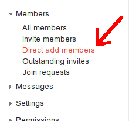

<h1 style="text-align:center">Documentation</h1>

* TOC
{:toc}

Cook Instructions
=================

Everybody cooks!  People with other roles are obligated to cook less.

1. Go into the First Church Somerville basement (if you can't remember the access code, ask somebody!).
1. In the kitchen, find the SGMC bin and the granola making instructions booklet.
3. Identify all the ingredients, which are stored in the closet beneath the stairs.
2. Check the <a href="/shift_matrix.html">shift matrix</a> to figure out how many pounds of granola to make (add up all the share amounts).
3. Follow the printed instructions.

Treasurer
=========

Current Tresurer: Emily

Responsibilities are outlined in the subsections below.

Checks and memberships
----------------------

Deposit checks written out to the coop, and maintain a list of members.

Renewal
-------

Ask members to renew 30 days prior to the end of their term.  Only after they
are fully renewed, notify the shift manager.

Shift Manager
=============

Current Shift Manager: Troy

Onboarding
----------

Use this email template for new members:

```
[NAME OF NEW MEMBER],

Hi prospective granola coop member!  My role is Shift Manager, and I'm
responsible for onboarding.  Firstly, if you're interested in joining,
please familiarize yourself with member responsibilities:

http://somervillegranolamakingcoop.github.io/

fill out the application form:

https://goo.gl/cPFnYr

and deliver the completed form and check to First Church Somerville, 89
College Ave, Somerville, MA 02144.

Your prospective term is [INSERT DATE RANGE].
Please take a look at the shift matrix and request two cooking shifts in
your term:

http://somervillegranolamakingcoop.github.io/shift_matrix.html

The dates are also copied below:

[PASTE 6 DATES FROM THE MATRIX HERE]

Let me know which two dates you want (respond to this email), and I'll
put them in the database.

[YOUR NAME AND SIGNATURE]
```

Managing shifts and facilitating signups
----------------------------------------

IT Instructions
===============

Current IT: Troy, Sam

Adding emails to the mailing list
---------------------------------

If you are a group owner, and you need to add somebody to the SGMC mailing
list, get their email address and add them directly:

1. Go to the [member management page](https://groups.google.com/forum/#!managemembers/somervillegranolamakingcoop/members/active)
2. Click on "Direct Add Members" 

You can also ask people to add themselves to the mailing list by sending mail
to <somervillegranolamakingcoop+subscribe@googlegroups.com>.
